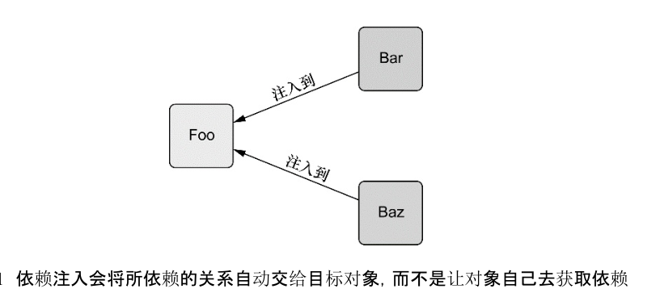
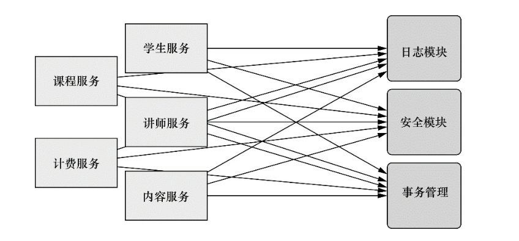
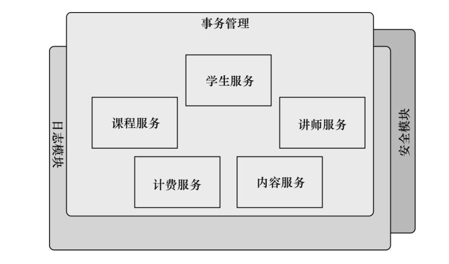
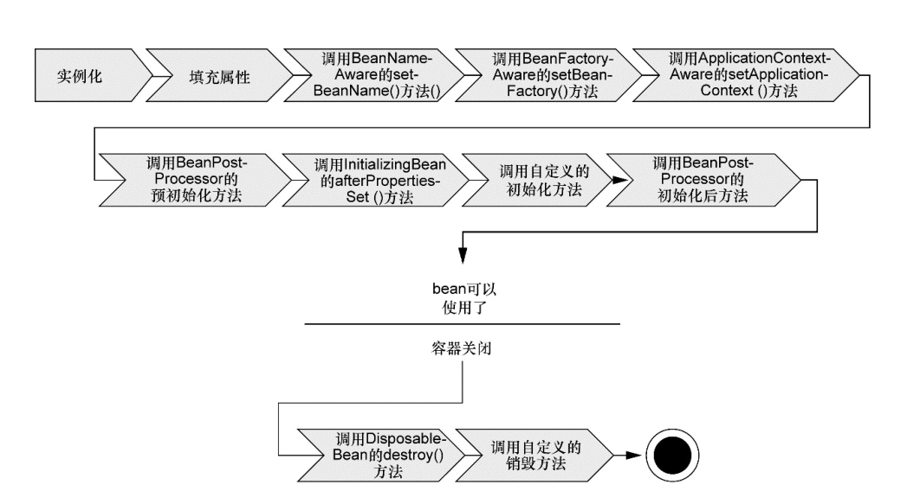
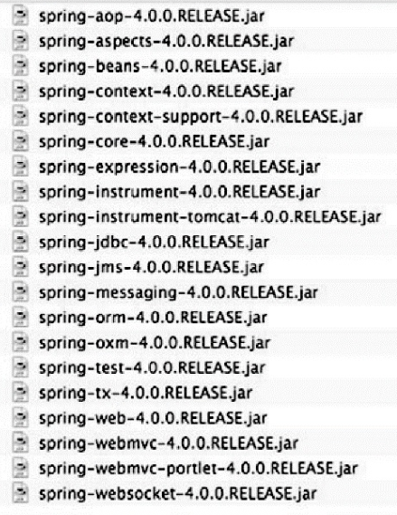
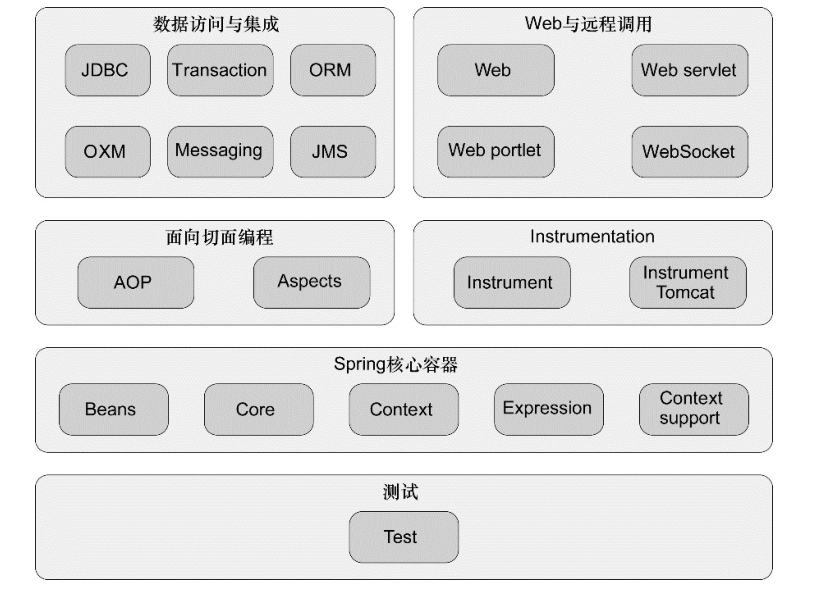
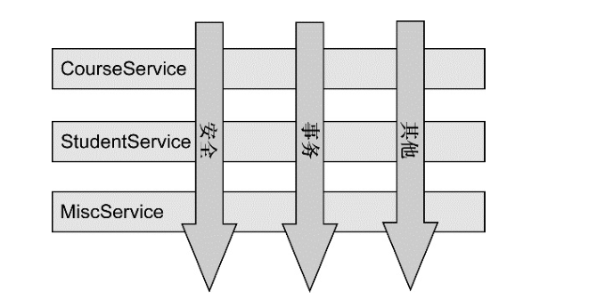
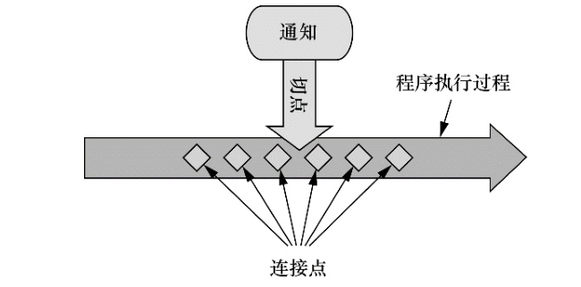

# Spring in Action 阅读与学习笔记

PS：《Spring in Action》第四版，作者：Cragin Walls，译者：张卫滨

## 1. Spring之旅

### 1.1 简化Java开发

`Spring`是一个开源框架，最早是由`Rod Johnson`创建。Spring是为了解决企业级应用开发的复杂性而创建的，使用Spring可以让简单JavaBean实现之前只有EJB才能完成的事情。

但Spring不仅仅局限于服务器端开发，`任何Java应用都能在简单性、可测试性和松耦合等方面从Spring中获益`。

Spring的最根本使用是：`简化Java开发`。

为了降低Java开发的复杂性，Spring采取了一下4中关键策略：

+ 基于POJO的`轻量级`和`最小侵入性`（[入侵式和非侵入式编程的区别](http://www.myexception.cn/program/614076.html)）编程
+ 通过`依赖注入`和`面向接口`实现`松耦合`
+ 基于`切面`和`惯例`进行`声明式编程`
+ 通过`切面`和`模板`减少样式代码

#### 1.1.1 激发POJO的潜能

虽然Spring用`bean`或`JavaBean`来表示应用组件，但不意味着Spring组件必须要遵循`JavaBean规范`。一个Spring组件可以是任何形式的`POJO`（
[JAVABEAN EJB POJO区别](http://www.cnblogs.com/yw-ah/p/5795751.html)）。

很多框架通过强迫应用继承它们的类或实现它们的接口从而导致应用于框架绑死。这种`侵入式`的编程方式在早期版本的`Struts`、`WebWork`等其他Java规范和框架中都能看到。

Spring竭力避免因自身的API而弄乱应用代码。Spring不会强迫开发者实现Spring规范的接口或继承Spring规范的类，相反，在基于Spring构建的应用中，它的类通常没有任何痕迹表明使用了Spring。最坏的场景是，一个类或许会使用Spring注解，但它依旧是POJO。

如下例：

```java
public class HelloWorldBean{
    public String sayHello(){
        return "Hello World";
    }
}
```

可以看到，这是一个简单普通的Java类--`POJO`。没有任何地方表明它是一个Spring组件。Spring的`非侵入式编程模型`意味着这个类在Spring应用和非Spring应用中都可以发挥同样的作用。

尽管形式看起来很简单，但是`POJO`一样可以具有魔力。Spring赋予`POJO`魔力的方式之一就是通过`DI`来装配它们。

#### 1.1.2 依赖注入

在项目中使用`DI`，代码变得异常简单并且更容易理解和测试。

任何一个具有实际意义的应用都会由`两个或者更多的类`组成，这些类之间进行写作来完成特定的业务逻辑。按照传统做法，每个对象负责管理与自己相互协作的对象（即它所依赖的对象）的引用，这将会导致高度耦合和难以测试的代码。

如下例：

```java
package sia.knights;

public class DamselRescuingKnight implements Knight {

    private RescueDamselQuest quest;

    public DamselRescuingKnight() {
        this.quest = new RescueDamselQuest();// 与ResuceDamselQuest紧耦合
    }

    @Override
    public void embarOnQuest() {
        quest.embark();
    }

}
```

可以看到，`DamselRescuingKnight`在它的构造函数中自行创建了`RescueDamselQuest`。这使得DameselRescuingKnight与RescueDamselQuest`紧耦合`，这极大的`限制`了这个骑士执行探险的能力，仅仅只有救援少女的能力，不具备其他能力了。

更糟糕的是，为这个DamselRescuingKnight编写`单元测试将出奇困难`。在这样的测试中，必须保证当骑士的embarkOnQuest()被调用的时候，探险的embark()方法也要被调用。

耦合具有`两面性`。

+ 紧密耦合的代码`难以测试`、`难以复用`、`难以理解`，并且典型地出现`“打地鼠”`的bug特征（修复一个bug，将会出现一个或者更多新的bug）。
+ 一定程度耦合是`必须的`。完全没有耦合的代码什么也做不了。

为了完成具有实际意义的功能，不同的类必须以适当的方式进行交互。总而言之，`耦合是必须的，但应当被小心谨慎地管理`。

通过`DI`，对象的依赖关系将有系统中负责协调各对象的第三方组件在创建对象的时候进行设定。对象无需自行创建或管理它们的依赖关系。

如下图，依赖关系将自动注入到需要它们的对象当中去。



```java
package sia.knights;

public class BraveKnight implements Knight {

    private Quest quest;

    public BraveKnight(Quest quest) {// Quest注入
        this.quest = quest;
    }

    @Override
    public void embarOnQuest() {
        quest.embark();
    }

}
```

不同于之前的DamselRescuingKnighy，BraveKnight没有自行创建探险任务，而是在构造的时候把探险任务作为构造器参数传入。这是依赖注入的方式之一，即`构造器注入(constructor injection)`。

更重要的是传入的探险类型是`Quest`，也就是所有探险任务都必须实现的一个`接口`。所以，BraveKnight能够相应RescueDamselQuest，SlayDragonQuest等`任意的Quest实现`。

这里的要点是BraveKnight没有与任何特定的Quest实现发生`耦合`。对于BraveKnight而言，被要求挑战的探险任务只要实现了Quest`接口`，那么具体是哪种类型的探险就无关紧要了。这就是DI带来的最大收益--`松耦合`。

>如果一个对象只通过接口（而不是具体实现或初始化过程）来表明依赖关系，那么这种依赖就能够在对象毫不知情的情况下，用不同的具体实现进行替换。

对依赖进行替换的一个最常用方法就是在测试的时候使用`mock`实现。我们无法充分地测试DamselRescuingKnight，因为它是紧耦合的。但是可以轻松地测试BraveKnight，只需要给它一个Quest的mock实现即可。

```java
package sia.knights;

import static org.mockito.Mockito.*;

import org.junit.Test;

public class BraveKnightTest {

    @Test
    public void testEmbarOnQuest() {
        Quest mockQuest = mock(Quest.class);// Mock一个Quest
        BraveKnight knight = new BraveKnight(mockQuest);// 将Mock出来的Quest注入
        knight.embarOnQuest();
        verify(mockQuest, times(1)).embark();
    }

}
```

可以使用mock框架`Mcokito去`创建一个Quest接口的mock实现。通过这个mock对象，就可以创建一个新的BraveKnight实例，并通过`构造器注入`这个mock Quest。当调用embarkOnQuest()时，可以使用Mockito框架验证Quest的mock实现的embark()仅仅被调用了一次。

现在BraveKnight类可以接受传递任意一种Quest实现，但如何把特定的Quest实现传递给它呢？
假设，希望BraveKnight要进行的探险任务是杀死一只怪龙。

```java
package sia.knights;

import java.io.PrintStream;

public class SlayDragonQuest implements Quest {

    private PrintStream printStream;

    public SlayDragonQuest(PrintStream printStream) {
        this.printStream = printStream;
    }

    @Override
    public void embark() {
        printStream.println("Embarking on quest to slay the dragon!");
    }

}
```

可以看到，SlayDragonQuest实现了Quest接口，这样就可以注入到BraveKnight中去了。SlayDragonQuest没有使用System.out.println()，而是在构造方法中请求一个更为通用的PrintStream。这里最大的问题是，我们如何将SlayDragonQuest交给BraveKnight？又如何将PrintStream交个SlayDragonQuest？

创建应用组件之间协作的行为通常称为`装配（wiring）`。

Spring有多种装配方式：

+ 基于XML配置
+ 基于注解配置
+ 基于Java类配置

[三种装配Bean方式比较](http://www.cnblogs.com/JsonShare/p/4630088.html)

以下是基于Java类配置：

```java
package sia.knights.config;

import org.springframework.context.annotation.Bean;
import org.springframework.context.annotation.Configuration;

import sia.knights.BraveKnight;
import sia.knights.Knight;
import sia.knights.Quest;
import sia.knights.SlayDragonQuest;

@Configuration
public class KnightConfig {

    @Bean
    public Knight knight() {
        return new BraveKnight(quest());// 注入Quest
    }

    @Bean
    public Quest quest() {
        return new SlayDragonQuest(System.out);// 创建SlayDragonQuest
    }
}
```

在这里，BraveKnight和SlayDragonQuest被声明为spring中的bean。就BraveKnight而言，它在构造时传入了对SlayDragonQuest bean的引用，将其作为构造器参数。将System.out(这是一个PrintStream)传入到了SlayDragonQuest的构造器中。

尽管BraveKnight依赖于Quest，但是它并不知道传递给它的是什么类型的Quest，也不知道这个Quest来自哪里。与之类似，SlayDragonQuest依赖于PrintStream，但是在编码时它并不需要知道这个PrintStream是什么样子的。

>只有Spring通过它的配置，能够了解这些组成部分是如何装配起来的。这样的话，就可以在不改变所依赖的类的情况下，修改依赖关系。

如何工作？

Spring通过`应用上下文(Application Context)`装载bean的定义并把它们组装起来。Spring应用上下文全权负责对象的创建和组装。Spring自带了多种应用上下文的实现，它们之间主要的区别就是在于如何加载配置。

```java
package sia.knights;

import org.springframework.context.annotation.AnnotationConfigApplicationContext;

import sia.knights.config.KnightConfig;

public class KnightMain {

    public static void main(String[] args) {
        AnnotationConfigApplicationContext context = // 加载Spring上下文
                new AnnotationConfigApplicationContext(KnightConfig.class);
        Knight knight = context.getBean(Knight.class); // 获取Knight bean
        knight.embarOnQuest(); // 使用Knight的方法
        context.close();
    }

}
```

main方法基于KnightConfig创建了Spring应用上下文。随后它调用该应用上下文获取一个`ID`为knight的bean。得到Knight对象的引用后，就可以调用方法。

>注意这个类完全不知道我们的英雄其实接收哪种探险任务，而且完全没有意识到这是由BraveKnight来执行的。只有KnightConfig文件知道哪个其实执行哪种探险任务。

#### 1.1.3 应用切面

DI能够让相互协作的软件组件保持`松耦合`，而`面向切面编程(aspect-oriented programming,AOP)`允许把遍布应用各处的功能分离出来形成`可重用`的组件。

面向切面编程往往被定义为促使软件系统实现关注点的分离的一项技术。系统由许多不同的组件组成，每一个组件各负责一块特定功能。除了实现自身核心的功能外，这些组件还经常承担着额外的职责。诸如日志、事务管理和安全这样的系统服务经常融入到自身具有核心业务逻辑的组件中去，这些系统服务通常被称为横切关注点，因为它们会跨越系统的多个组件。

如果将这些关注点分散到多个组件中去，代码会带来双重的复杂性。

+ 实现系统关注点功能的代码将会重复出现在多个组件中。这意味着如果你要改变这些关注点的逻辑，必须修改各个模块的相关实现。即使你把这些关注点抽象成一个独立的模块，其他模块只是调用它的方法，但方法的调用还是会重复出现在各个模块中。
+ 组件会因为那些与自身核心业务无关的代码而变得混乱。一个向地址簿增加地址条目的方法应该只关注如何添加地址，而不应该关注它是不是安全的或者是否需要支持事务。



>左边的业务对象与系统级服务结合得过于紧密。每个对象不但要知道它需要记录日志、进行安全控制和参与事务，还要亲自执行这些服务。

AOP能够使这些服务`模块化`，并以声明的方式将它们应用到它们需要影响的组件中去。所造成的结果就是这些组件会具有更高的`内聚性`并且会更加`关注自身的业务`，完全不需要了解涉及系统服务所带来复杂性。

>总之，AOP能够确保POJO的简单性。



我们可以把`切面`想象成为覆盖很多组件之上的一个外壳。应用是由那些实现各自业务功能的模块组成的。借助AOP，可以使用各种功能层去`包裹核心业务层`。这些层以声明的方式灵活地应用到系统中，你的核心应用设置根本不知道它们的存在。这是一个非常强大的理念，可以将`安全`、`事务`和`日志关注点`与核心业务逻辑`相分离`。

如何将AOP应用到上例中？

吟游诗人这个服务类负责记载其实的所有事迹。

```java
package sia.knights;

import java.io.PrintStream;

public class Minstrel {

    private PrintStream printStream;

    public Minstrel(PrintStream printStream) {
        this.printStream = printStream;
    }

    public void singBeforeQuest() {// 探险前调用
        printStream.println("探险前..............");
    }

    public void singAfterQuest() {// 探险后调用
        printStream.println("探险后..............");
    }
}
```

Minstrel是只有两个方法的简单类。在骑士执行每一个探险任务之前，singBeforeQuest()会被调用；在骑士完成探险任务后，singAfterQuest()会被调用。

BraveKnight和Minstrel组合，BraveKnight必须要调用Minstrel的方法：

```java
package sia.knights;

public class BraveKnight implements Knight {

    private Quest quest;
    private Minstrel minstrel;

    public BraveKnight(Quest quest, Minstrel minstrel) {// Quest注入
        this.quest = quest;
        this.minstrel = minstrel;
    }

    @Override
    public void embarOnQuest() {
        minstrel.singBeforeQuest();// 骑士需要管理吟游诗人吗？
        quest.embark();
        minstrel.singAfterQuest();
    }

}
```

>管理他的吟游诗人真的是骑士职责范围内的工作吗？

骑士需要知道吟游诗人的存在，所以就必须把Minstrel注入到BraveKnight中。这使得BraveKnight的代码复杂化了，也会让Minstrel和BraveKnight结合得过于紧密了。如果需要骑士不需要吟游诗人呢，那不是要新建一个类？如果Minstrel为null会怎样，是否需要引入一个空值校验逻辑来覆盖这个场景？

>简单的BraveKnight类开始变得复杂，如果你还需要应对没有吟游诗人时的场景，那代码会变得更加复杂。但利用AOP，你可以声明吟游诗人必须歌颂骑士的探险事迹，而骑士本身并不需要直接访问Minstrel的方法。

要将Minstrel抽象为一个切面，需要在Spring配置文件中声明它。

代码在学习AOP后再补充。。。

#### 1.1.4 使用模板消除样板式代码

`样板式代码(boilerplate code)`--通常为了实现通用和简单的任务，不得不一遍遍重复编写重复代码。

许多Java API，例如JDBC，会涉及编写大量的样板式代码

+ 首先要创建一个数据库连接
+ 再创建一个语句查询
+ 进行查询
+ 为了平息JDBC可能出现的怒火，必须捕捉SQLException，这是一个检查型异常，即使它抛出后也做不了太多事情
+ 关闭数据库连接、语句和结果集
+ 依然要捕捉SQLException

JDBC操作要编写的代码千篇一律。只有少量的代码是SQL查询，其他的代码都是JDBC的样板代码。

JDBC不是产生样板式代码的唯一场景。在许多编程场景中往往都会导致类似的样板式代码，JMS、JNDI和使用REST服务通常也涉及大量的重复代码。

>Spring旨在通过模板封装来消除样板式代码。

Spring的JdbcTemplate使得执行数据库操作时，避免传统的JDBC样板代码成为了可能。我们仅仅需要关注查询的`核心逻辑`，而不需要迎合JDBC API的需求。

例子在碰到的时候再补充。。。。

### 1.2 容纳你的Bean

在基于Spring的应用中，应用对象生存于Spring容器(Container)中。

[应用对象存在于Spring容器中](./iamges/1.3-1.PNG)

Spring容器负责创建对象，装配它们，配置它们并管理它们的整个生命周期，从生存到死亡。

>容器是Spring框架的核心。Spring容器使用DI管理构成应用的组件，它会创建相互协作的组件之间的关联。毫无疑问，这些对象更简单干净，更易于理解，更易于重用并且更易于进行单元测试。

Spring容器的实现类型

+ bean工厂是最简单的内容器，提供基本的DI支持。
+ 应用上下文基于BeanFactory构建，并提供应用框架级别的服务，例如从属性文件解析文本信息以及发布应用事件给感兴趣的事件监听者。

>bean工厂对大多数应用来说往往太低级，因此应用上下文要比bean工厂更受欢迎。

####　1.2.1 使用应用上下文

Spring自带多种类型的应用上下文： 

+ AnnotationConfigApplictionContext：从一个或多个`基于Java的配置类`中加载`Spring应用上下文`
+ AnnotationConfigWebApplicationContext：从一个或多个基于`Java的配置类`中加载`Spring Web应用上下文`
+ ClassPathXmlApplicationContext：从类路径下的一个或多个XML配置文件中加载上下文定义，把应用上下文的定义文件作为类资源
+ FileSystemXmlApplicationContext：从文件系统下的一个或多个XML配置文件中加载上下文定义。
+ XmlWebApplicationContext：从Web应用下的一个或多个XML配置文件中加载上下文定义

应用上下文准备就绪后，就可以调用上下文的getBean()从Spring容器中获取bean。

#### 1.2.2 bean的生命周期

在传统的Java应用中，bean的生命周期很简单。使用Java关键字new进行bean实例化，然后该bean就可以使用了。一旦该bean不再被使用了，则由Java自动进行垃圾回收。

>相比之下，Spring容器的bean的生命周期就显得相对复杂多了。正确理解Spring bean的生命周期非常重要，因为你或许要利用Spring提供的扩展点来自定义bean的创建过程（碰到的时候再添加例子）。



1. Spring对bean进行实例化
2. Spring将值和bean的引用注入到bean对应的属性中
3. 如果bean实现了BeanNameAware接口，Spring将bean的ID传递给setBeanName()
4. 如果bean实现了BeanFactoryAware接口，Spring将调用setBeanFactory()，将BeanFactory容器实例传入
5. 如果bean实现了ApplicationContextAware接口，Spring将调用setApplicationContext()，将bean所在的应用上下文的引用传入进来
6. 如果bean实现了BeanPostProcessor接口，Spring将调用它们的postProccessBeforeInitializingBean()
7. 如果bean实现了InitializingBean接口，Spring将调用它们的afterPropertiesSet()。类似的，如果bean使用自定义初始化方法，该方法也会被调用
8. 如果bean实现了BeanPostProcessor接口，Spring将调用它们的postProcessAfterInitialization()
9. 此时，bean已经准备就绪，可被应用程序使用了。它们将一直驻留在应用上下文中，直到该应用上下文被销毁。
10. 如果bean实现了DisposableBean接口，Spring将调用它的destroy()。同样，如果bean使用了自定义销毁方法，该方法也会被调用。

>一个空的容器并没有太大的价值，在你把东西放进去之前，它里面什么都没有。为了从Spring的DI中收益，我们必须将应用对象装配进Spring容器中。

### 1.3 俯瞰Spring风景线

>Spring关注于通过DI、AOP和消除样板式代码来简化企业级Java开发。即使这是Spring能做的所有事情，那Spring也值得一用。但是，Spring实际上的功能超乎你的想象。

在Spring框架的范畴内，你会发现Spring简化Java开发的多种方式。但在Spring框架之外还存在一个构建在核心框架之上的庞大生态圈，它将Spring扩展到不同的领域，例如Web服务、REST、移动开发以及NoSQL。

#### 1.3.1 Spring模块

在Spring 4.0中，Spring框架的发布版本包括了20个不同的模块，每个模块会有3个JAR文件（二进制类库、源码的JAR文件以及JavaDoc的JAR文件）。



这些模块根据其所属的功能可以划分为6类不同的功能。



>总体而言，这些模块为开发企业级应用提供了所需的一切。但是你也不必将应用建立在整个Spring框架之上，你可以自由地选择适合自身应用需求的Spring模块；当Spring不能满足需求时，完全可以考虑其他选择。事实上，Spring甚至提供了与其他第三方框架和类库的集成点，这样你就不需要自己编写这样的代码了。

##### Spring核心容器

容器是Spring框架最核心的部分，它管理着Spring应用中bean的创建、配置和管理。在该模块中，包括了Spring bean工厂，它为Spring提供了DI的功能。基于bean工厂，我们还会发现有多种Spring应用上下文的实现，每一种都提供了配置Spring的不同方式。

>除了bean工厂和应用上下文，该模块也提供了许多企业服务，例如E-mail、JNDI访问、EJB集成和调度。

所有的Spring模块都构建于核心容器之上。当你配置应用时，其实你隐式地使用了这些类。

##### Spring的AOP模块

在AOP模块中，Spring对面向切面编程提供了丰富的支持。这个模块是Spring应用系统中开发切面的基础。与DI一样，AOP可以帮助应用对象解耦。借助AOP，可以将遍布系统的关注点（例如事务和安全）从它们所应用的对象中解耦出来。

##### 数据访问与集成

使用JDBC编写代码通常会导致大量的样板式代码，例如获得数据库连接、创建语句、处理结果集到最后关闭数据库连接。Spring的JDBC和DAO(Data Access Object)模块抽象了这些样板式代码，使我们的数据库代码变得简单明了，还可以避免因为关闭数据库资源失败而引发的问题。该模块在多种数据库服务的错误信息之上构建了一个语义丰富的异常层，以后我们再也不用解释那些隐晦专有的SQL错误信息了。

而且，Spring提供了ORM模块。Spring的ORM模块建立在对DAO的支持之上，并未多个ORM框架提供了一种构建DAO的简便方式。Spring没有尝试去创建自己的ORM解决方案，而是对许多流行的ORM框架进行了集成，包括Hibernate、Java Persisternce API等。Spring的事务管理支持所有的ORM框架以及JDBC。

##### Web与远程调用

MVC(Model-View-Controller)模式是一种普遍被接受的构建Web应用的方法，它可以帮助用户将界面逻辑与应用逻辑分离。

虽然Spring能够与多种流行的MVC框架进行集成，但它的Web和远程调用模块自带了一个强大的MVC框架，有助于在Web层提升应用的松耦合。

#### 1.3.2 Spring Portfolio

>事实上，Spring远不止Spring框架所下载的那些。整个Spring Portfolio包括多个构建于核心Spring框架之上的框架和类库。概括地讲，整个Spring Portfolio几乎为每一个领域的Java开发都提供了Spring编程模型。

##### Spring Web Flow

>Spring Web Flow建立于Spring MVC框架之上，它为基于流程的会话式Web应用（购物车或者向导功能）提供了支持。

##### Spring Security

>安全对于许多应用都是一个非常关键的切面。利用Spring AOP，Spring Security为Spring应用提供了声明式的安全机制。

##### Spring Data

>Spirng Data使得在Spring中使用任何数据库都变得非常容易。尽管关系型数据库统治企业级应用多年，但是现代化的应在正在认识到并不是所有的数据都适合放在一张表中的行和列中。一种新的数据库种类，通常称之为NoSQL数据库，提供了使用数据的新方法，这些方法比传统的关系型数据库更为合适。

不管你使用文档数据库，如MongoDB，图数据库，如Neo4j，还是传统的关系型数据库，Spring Data都为持久化提供了一种简单的编程模型。这包括为多种数据库类型提供了一种自动化的Repository机制，它负责为你创建Repository的实现。

##### Spring Boot

>Spring极大地简化了众多的编程任务，减少甚至消除了很多样板式代码，如果没有Spring的话，在日常工作中你不得不编写这样的样板代码。Spring Boot是一个崭新的令人兴奋的项目，它以Spring的视角，致力于简化Spring本身。

Spring Boot大量依赖于自动配置技术，它能够消除大部分Spring配置。它还提供了多个Starter项目，不管你使用Maven还是Gradle，这都能减少Spring工程构建文件的大小。

>Spring Portfolio远不止这些项目。。。

## 2.0 装配Bean

在Sping中，对象无需自己查找或创建与其所关联的其他对象。相反，容器负责把需要相互协作的对象引用赋予各个对象。例如，一个订单管理组件需要信用卡认证组件，但它不需要自己创建信用卡认证组件。订单管理组件只需要表明自己两手空空，容器就会主动赋予它一个信用卡认证组件。

>创建对象之间协作关系的行为通常称为装配(wiring)，这也是依赖注入的本质。

### 2.1 Spring配置的可选方案

Spring具有非常大的灵活性，它提供了三种主要的装配机制：

+ 在XML中进行显式配置
+ 在Java中进行显式配置
+ 隐式的bean发现机制和自动装配

>显示配置越少越好。当必须要显式配置bean的时候（比如，有些源码不是由你来维护的，而当你需要为这些代码配置bean的时候），推荐使用类型安全并且比XML更加强大的JavaConfig。最后，只有想要使用便利的XML命名空间，并且在JavaConfig没有同样的实现时，才应该使用XML。

### 2.2 自动化装配bean

>尽管你会发现显示装配技术非常有用，但是在便利性方面，最强大的还是Spring的自动化配置。如果Spring能够自动化装配的话，那何苦还要显示地讲这些bean装配在一起呢？

Spring从两个角度来实现自动化装配：

+ 组件扫描(component scanning)：Spring会自动发现应用上下文所创建的bean
+ 自动装配(autowiring)：Spring自动满足bean之间的依赖

>组件扫描和自动装配组合在一起就能发挥出强大的威力，它们能够将你的显式配置降低到最少。

为了阐述组件扫描和自动装配，我们需要创建几个bean，它们代表了一个音响系统中的组件。首先，要创建CompactDisc类，Spring会自动发现它并将其创建为一个bean。然后，会创建一个CDPlayer类，让Spring发现它，并将CompactDisc bean注入进来。

#### 2.2.1 创建可被发现的bean

如果不将CD(compact disc)插入(注入)到CD播放器中，那么CD播放器其实是没有太大用处的。所以，可以这样说，CD播放器依赖于CD才能完成它的使命。

```java
package soundSystem;

public interface CompactDisc {
    void play();
}
```

CompactDisc的具体内容并不重要，重要的是你将其定义为一个接口。作为接口，它定义了CD播放器对一盘CD所能进行的操作。它将CD播放器的任意实现与CD本身的耦合降低了最小的程度。

我们还需要一个CompactDisc的实现，实际上，我们可以有CompactDisc接口的多个实现。

```java
package soundSystem;

import org.springframework.stereotype.Component;

@Component
public class SgtPeppers implements CompactDisc {

    private String title = "Sgt. Pepper's Lonely Hearts Club Band";
    private String artist = "The Beatles";

    @Override
    public void play() {
        System.out.println("Playing " + title + " by " + artist);
    }

}
```

和CompactDisc接口一样，SgtPeppers的具体内容并不重要。需要注意的是SgtPeppers类上使用了@Component注解。这个简单的注解表明该类会作为组件类，并告知Spring要为这个类创建bean。没有必要显式配置SgtPeppers bean，因为这个类使用了@Component注解，所以Spring会为你把事情处理妥当。

>组件扫描默认是不启用的。我们还需要显式配置一下Spring，从而命令它去寻找带有@Component注解的类，并为其创建bean。

```java
package soundSystem;

import org.springframework.context.annotation.ComponentScan;
import org.springframework.context.annotation.Configuration;

@Configuration
@ComponentScan
public class CDPlayerConfig {

}
```

类CDPlayerConfig通过Java代码定义了Spring的装配规则。CDPlayerConfig类并没有显式地声明任何bean，只不过它使用了@ComponentScan注解，这个注解能够在Spring中启用组件扫描。

>如果没有其他配置的话，@ComponentScan默认会扫描与配置类相同的包以及这个包下的所有子包，查找带有@Component注解的类。

创建一个简单的JUnit测试，它会创建Spring上下文，并判断CompactDisc是否真的创建出来了。

```java
package soundSystem;

import static org.junit.Assert.*;

import org.junit.Test;
import org.junit.runner.RunWith;
import org.springframework.beans.factory.annotation.Autowired;
import org.springframework.test.context.ContextConfiguration;
import org.springframework.test.context.junit4.SpringJUnit4ClassRunner;

@RunWith(SpringJUnit4ClassRunner.class)
@ContextConfiguration(classes=CDPlayerConfig.class)
public class CDPlayerTest {

    @Autowired
    private CompactDisc cd;
    
    @Test
    public void cdShouldNotBeNull() {
        assertNotNull(cd);
    }

}
```

CDPlayerTest使用了Spring的SpringJUnit4ClassRunner，以便在测试开始的时候自动创建Spring的应用上下文。注解@ContextConfiguration会告诉它需要在CDPlayerConfig中加载配置。

在测试代码中有一个CompactDisc类型的属性，并且这个属性带有@Autowired注解，以便于将CompactDisc bean注入到测试代码中。最后，会有一个简单的测试方法断言cd属性不为null。如果它不为null的话，就意味着Spring能够发现CompactDisc类，自动在Spring上下文中将其创建为bean并将其注入到代码中来。

>在soundSystem包及其子包中，所有带有@Component注解的类都会被创建为bean。只添加一行@component注解就能自动创建无数个bean，这种权衡还是很划算的。

#### 2.2.2 为组件扫描的bean命名

Spring应用上下文中所有的bean都会给定一个ID。在前面的例子中，尽管我们没有明确地为SgtPeppers bean设置ID，但Spring会根据类名为其指定一个ID。具体来讲，这个bean所给定的ID为sgtPeppers，也就是将类名的第一个字母变为小写。

>如果想为这个bean设置不同的ID，只需要将期望的ID值传递给@Component注解。

```java
@Component("lonelyHeartClub")
public class SgtPeppers implements CompactDisc {
    ........
}
```

>还有另一种为bean命名的方式，这种方式不使用@Component注解，而是使用Java依赖注入规范(Java Dependency Injection)中所提供的@Named注解来为bean设置ID

```java
@Named("lonelyHeartClub")
public class SgtPeppers implements CompactDisc {
    ........
}
```

Spring支持将@Named作为@Component注解的替代方案。两者之间有一些细微的差异，但是在大多数场景中，它们是可以互相替换的。

>个人觉得@Component语义性强一点。

#### 2.2.3 设置组件扫描的基础包

按照默认规则，@Component注解会以配置类所在的包作为基础包(base package)来扫描组件。

>但是，如果想要扫描不同的包，或者扫描多个基础包，又或者是遇到配置类放在单独的包中，使其与其他的应用代码区分开来，那应该怎么配置？

为了指定不同的基础包，需要做的就是在@ComponScan的value属性中指明包的名称：

```java
@Configuration
@ComponentScan("soundSystem")
public class CDPlayerConfig{}
```

如果想要更加明确所设置的是基础包，那么可以通过basePackages属性进行配置：

```java
@Configuration
@ComponentScan(basePackages="soundSystem")
public class CDPlayerConfig{}
```

basePackages属性使用的是复数形式，可以设置多个基础包，只需要将basePackages属性设置为要扫描包的一个数组即可：

```java
@Configuration
@ComponentScan(basePackages={"soundSystem","video"})
public class CDPlayerConfig{}
```

上例中，基础包是以String类型表示的，这种方法是类型不安全(not type-safe)的。如果重构代码的时候，那么所指定的基础包可能就会出现错误了。

>除了将包设置为简单的String类型之外，@ComponentScan还提供了另外一种方法，那就是将其指定为包中所包含的类或接口：

```java
@Configuration
@ComponentScan(basePackageClasses={CDPlayer.class,DVDPlayer.class})
public class CDPlayerConfig{}
```

可以看到，basePackages属性被替换成了basePackageClasses。同时，不再使用String类型的名称来指定包，为basePackageClasses属性所配置的数组中包含了类。这些类所在的包将会作为组件扫描的基础包。

>尽管在样例中，为basePackageClasses设置的是组件类，但是可以在包中创建一个用来进行扫描的空标记接口。通过标记接口的方式，依然能够保持对重构友好的接口引用，但是可以避免引用任何实际的应用程序代码（因为，可能在重构的时候，这些应用代码可能会从想要扫描的包中删除）。

在应用程序中，如果所有的对象都是独立的，彼此之间都没有任何依赖，那么所需要的就是组件扫描了。但是，很多对象会依赖其他的对象才能完成任务。这样的话，我们就需要有一种方法能够将组件扫描得到的bean和它们的依赖装配在一起。

#### 2.2.4 通过为bean添加注解实现自动装配

简单来说，自动装配就是让Spring自动满足bean依赖的一种方法，在满足依赖的过程中，会在Spring应用上下文中寻找匹配某个bean需求的其他bean。为了声明要进行自动装配，可以借助Spring的@Autowired注解。

```java
package soundSystem;

import org.springframework.beans.factory.annotation.Autowired;
import org.springframework.stereotype.Component;

@Component
public class CDPlayer implements MediaPlayer {

    private CompactDisc cd;

    @Autowired
    public CDPlayer(CompactDisc cd) {
        this.cd = cd;
    }

    @Override
    public void play() {
        cd.play();
    }

}
```

CDPlayer类的构造器上添加了@Autowired注解，这表明当Spring创建CDPlayer bean的时候，会通过这个构造器进行实例化并传入一个可设置给成CompactDisc类型的bean。

@Autowired注解不仅能够用在构造器上，还能用在属性的Setter方法上。比如说，如果CDPlayer有一个setCompactDisc()，那么就可以采用如下的注解形式进行自动装配：

```java
@Autowired
public vodi setCompactDisc(CompactDisc cd) {
    this.cd = cd;
}
```

实际上，@Autowired注解可以用在类的任何方法上。假设，CDPlayer类有一个insertDisc()：

```java
@Autowired
public vodi insertDisc(CompactDisc cd) {
    this.cd = cd;
}
```

>不管是构造器、Setter方法还是其他的方法，Spring都会尝试满足方法参数上所声明的依赖。加入有且只有一个bean匹配依赖需求的话，那么这个bean就会被装配进来。

如果没有匹配的bean，那么在应用上下文创建的时候，Spring会抛出一个异常。为了避免异常的出现，你可以将@Autowired的required属性设置为false：

```java
@Autowired(required = false)
public CDPlayer(CompactDisc cd) {
    this.cd = cd;
}
```

将required属性设置为false，Spring会尝试执行自动装配，但是如果没有匹配的bean的时候，Spring将会让这个bean处于未装配的状态。但是，如果代码中没有进行null检查的话，这个处于未装配状态的属性有可能会出现NullPointerException。

>如果有多个bean都能满足依赖关系的话，Spring将会抛出一个异常，表明没有明确指定要选择哪个bean进行自动装配。自动装配中的歧义性。

@Inject注解来自Java依赖注入规范，@Inject和@Autowired之间有着细微差别，但是在大多数场景下，两者是可以替换的。

>还是那句话，@Autowired语义性更强。

#### 2.2.5 验证自动装配

```java
package soundSystem;

import static org.junit.Assert.*;

import org.junit.Rule;
import org.junit.Test;
import org.junit.contrib.java.lang.system.StandardOutputStreamLog;
import org.junit.runner.RunWith;
import org.springframework.beans.factory.annotation.Autowired;
import org.springframework.test.context.ContextConfiguration;
import org.springframework.test.context.junit4.SpringJUnit4ClassRunner;

@RunWith(SpringJUnit4ClassRunner.class)
@ContextConfiguration(classes = CDPlayerConfig.class)
public class CDPlayerTest {

    @Rule
    public final StandardOutputStreamLog log = new StandardOutputStreamLog();

    @Autowired
    private MediaPlayer player;

    @Autowired
    private CompactDisc cd;

    @Test
    public void cdShouldNotBeNull() {
        assertNotNull(cd);
    }

    @Test
    public void testPlay() {
        player.play();
        assertEquals("Playing Sgt. Pepper's Lonely Hearts Club Band by The Beatles\n", log.getLog());
    }

}
```

貌似单元测试不对。。比较的值明明是正确的。。。

>找不到哪里出错了，所以修改了下例子。。。有时间再慢慢拿时间跟它耗，再更正了。。。

### 2.3 通过代码装配bean

>尽管在很多场景下通过组件扫描和自动装配实现Spring的自动化配置是更为推荐的方式，但有时候，自动化配置的方案行不通，因此需要明确配置Spring。比如说，你想要将第三方库中的组件装配到你的应用中，在这种情况下，是没有办法在它的类上添加@Component和@Autowired注解的，因此就不能使用自动化装配的方案了。

在这种情况下，你必须采用显示装配的方式。显式配置有两种可选方案：Java和XML。

在进行显式配置的时候，JavaConfig是更好的方案，因为它更强大、类型安全并且对重构友好。因为它就是Java代码，就像应用程序中的其他Java代码一样。

同时，JavaConfig与其他Java代码的又有所区别。在概念上讲，它与应用程序中的业务逻辑和领域代码是不同的。尽管它与其他的组件一样都是用相同语言进行表述，但JavaConfig是配置代码。这意味着它不应该包含任何业务逻辑，JavaConfig也不应该侵入到业务逻辑代码中。

>尽管不是必须的，但通常将JavaConfig放到单独的包中，使它与其他的应用程序逻辑分离开来，这样对于它的意图就不会产生困惑了。

#### 2.3.1 创建配置类

```java
package soundSystem;

import org.springframework.context.annotation.ComponentScan;
import org.springframework.context.annotation.Configuration;

@Configuration
public class CDPlayerConfig {

}
```

创建JavaConfig类的关键在于为其添加@Configuration注解，@Configuration注解表明这是一个配置类，该类应该包含在Spring应用上下文中如何创建bean的细节。

到这里，都是依赖组件扫描发现Spring应该创建的bean。尽管可以同时使用组件扫描和显式配置，但是我们先关注于显式配置，因此把@ComponentScan注解去掉了。

去掉@ComponentScan注解之后，CDPlayerConfig类就没有任何作用了。运行测试，会发现出现异常BeanCreationExcption。测试的时候希望注入CDPlayer和CompactDisc，但是这些bean根本就没有创建，因为组件扫描不会发现它们。

所以我们要在JavaConfig中声明bean。

#### 2.3.2 声明简单的bean

要在JavaConfig中声明bean，需要编写一个方法，这个方法会创建所需类型的实例，然后给这个方法添加@Bean注解。

```java
package soundSystem;

import org.springframework.context.annotation.Bean;
import org.springframework.context.annotation.Configuration;

@Configuration
public class CDPlayerConfig {

    @Bean
    public CompactDisc sgtPeppers() {
        return new SgtPeppers();
    }
}
```

@Bean注解会告诉Spring这个方法将会返回一个对象，该对象注册为Spring应用上下文中的bean。方法体中包含了最终产生bean实例的逻辑。

默认情况下，bean的ID与带有@Bean注解的方法名一样。但是可以通过name属性指定一个不同的名字：

```java
    @Bean(name = "lonelyHeartsClubBand")
    public CompactDisc sgtPeppers() {
        return new SgtPeppers();
    }
```

在一组CD中随机选择一个CompactDisc来播放：

```java
    @Bean
    public CompactDisc randomCD() {
        int choice = (int) Math.floor(Math.random() * 3);
        if (choice == 0) {
            return new SgtPeppers();
        } else if (choice == 1) {
            return new Actor();
        } else {
            return new LongTimeNoSee();
        }
    }
```

#### 2.3.3 借助JavaConfig实现注入

上例中，声明的CompactDisc bean是非常简单的，它自身没有其他的依赖。但现在，需要声明CDPlayer bean，它依赖于CompactDisc。

在JavaConfig中装配bean的最简单方式就是引用创建bean的方法。

```java
    @Bean
    public CDPlayer cdPlayer(){
        return new CDPlayer(sgtPeppers());
    }
```

cdPlayer()像sgtPeppers()一样，同样使用了@Bean注解，这表明这个方法会创建一个bean实例并将其注册到Spring应用上下文中。所创建的bean ID为cdPlayer，与方法的名字相同。

cdPlayer()的方法体与sgtPeppers()稍微有些区别。在这里并没有默认的构造器构建实例，而是调用了需要传入CompactDisc对象的构造器来创建CDPlayer实例。

看起来，CompactDisc是通过调用sgtPeppers()得到的，但是情况并非完全如此。因为sgtPeppers()添加了@Bean注解，Spring将会拦截所有对它的调用，并确保直接返回该方法所创建的bean，而不是每次都对其进行实际的调用。

```java
    @Bean
    public CDPlayer cdPlayer() {
        return new CDPlayer(sgtPeppers());
    }

    public CDPlayer anotherPlayer() {
        return new CDPlayer(sgtPeppers());
    }
```

假如对sgtPeppers()的调用就像其他的Java方法调用一样的话，那么每个CDPlayer实例都会有一个特有的SgtPeppers实例。

但是，默认情况下，Spring中的bean都是单例的，我们并没有必要为第二个CDPlayer bean创建完全相同的SgtPeppers实例。所以，Spring会拦截对sgtPeppers()的调用并确保返回的是Spring所创建的bean，也就是Spring本身在调用sgtPeppers()所创建的CompactDisc bean。因此，两个CDPlayer bean得到相同的SgtPeppers实例。

通过调用方法来引用bean的方式有点令人困惑，还有一种理解起来更为简单的方式：

```java
    @Bean
    public CDPlayer cdPlayer(CompactDisc cd) {
        return new CDPlayer(cd);
    }
```

可以看到，cdPlayer()请求一个CompactDisc作为参数。当Spring调用cdPlayer()创建CDPlayer bean的时候，它会自动装配一个CompactDisc到配置方法之中。然后，方法体就可以按照合适的方式来使用它。借助这种技术，cdPlayer()也能够将CompactDisc注入到CDPlayer的构造器中，而且不用明确引用CompactDisc的@Bean方法。

通常这种方式引用其他的bean是最佳的选择，因为它不会要求将CompactDisc声明到一个配置类中。在这里甚至没有要求CompactDisc必须要在JavaConfig中声明，实际它可以通过组件扫描功能自动发现或者通过XML来进行配置。你可以将配置分散到多个配置类、XML文件以及自动扫描和装配bean之中，只要功能完整健全即可。不管CompactDisc是采用什么方式创建出来的，Spring都会将其传入到配置方法中，并用来创建CDPlayer bean。

## 3. 高级装配

### 3.1 环境与profile

在开发软件的时候，有那么一些场景，就是将应用程序从一个环境迁移到另一个环境。开发阶段中，某些环境相关做法可能并不适合迁移到生产环境中，甚至迁移过去也无法正常工作。数据库配置、加密算法以及与外部系统的集成是跨环境部署时会发生变化的几个典型例子。

比如，在开发阶段，我们可能使用嵌入式数据库，并预先加载测试数据。

暂时跳过。。。

### 3.2 条件化的bean

鸡舍希望一个或多个bean只有在应用的类路径下包含特定的库时才创建。或者希望某个bean只有当另外某个特定的bean也声明了之后才会创建。甚至还可能要求只有某个特定的环境变量设置之后，才会创建某个bean。

@Conditional注解，它可以用到带有@Bean注解的方法上。如果给定的条件计算结果为true，就会创建这个bean，否则的话，这个bean就会被忽略。

```java
package springinaction.conditional;

import org.springframework.context.annotation.Bean;
import org.springframework.context.annotation.Conditional;
import org.springframework.context.annotation.Configuration;

@Configuration
public class MagicConfig {

	@Bean
	@Conditional(MagicExistCondition.class) //条件化创建bean
	public MagicBean magicBean() {
		return new MagicBean();
	}
}
```

可以看到，@Conditional给定了一个Class，它指明了条件--MagicExistCondition。只有设置了magic环境属性的时候，条件才成立，Spring会实例化这个类，如果环境中没有这个属性，那么MagicBean将会被忽略。

```java
package springinaction.conditional;


import org.springframework.context.annotation.Condition;
import org.springframework.context.annotation.ConditionContext;
import org.springframework.core.env.Environment;
import org.springframework.core.type.AnnotatedTypeMetadata;

public class MagicExistCondition implements Condition {

	@Override
	public boolean matches(ConditionContext context, AnnotatedTypeMetadata metadata) {
		Environment env=context.getEnvironment();
		return env.containsProperty("magic");
	}

}
```

设置给@Conditional的类可以是任意实现了Condition接口的类型。这个接口实现起来很直接，只需要提供matches()的实现即可。如果matches()返回true，那么就会创建带有@Conditional注解的bean。如果matches()返回false，将不会创建这些bean。

matches()简单但功能强大。它通过给定的ConditionContext对象进而得到Environment对象，并使用这个对象检查环境中是否存在名为magic的环境属性。

### 3.3 处理自动装配的歧义性

自动装配能够提供很大的帮助，因为它会减少装配应用程序组件时所需要的显式配置的数量。但是，仅有一个bean匹配所需的结果时，自动装配才是有效。如果不仅有一个bean能够匹配结果的话，这种歧义性会阻碍Spring自动装配属性、构造器参数或方法参数。

举个例子：

```java
public interface Dessert {

}

@Component
public class Cake implements Dessert {

}

@Component
public class Cookies implements Dessert {

}

@Component
public class IceCream implements Dessert {

}
```

Dessert是一个接口，并且有三个类实现了这个接口。

```java
package springinaction.ambiguity;

import static org.junit.Assert.assertNotNull;

import org.junit.Test;
import org.junit.runner.RunWith;
import org.springframework.beans.factory.annotation.Autowired;
import org.springframework.test.context.ContextConfiguration;
import org.springframework.test.context.junit4.SpringJUnit4ClassRunner;

@RunWith(SpringJUnit4ClassRunner.class)
@ContextConfiguration(classes = DessertConfig.class)
public class DessertConfigTest {

    @Autowired
    private Dessert dessert;
    
    @Test
    public void test() {
        assertNotNull(dessert);
    }

}
```

因为这三个类都使用了@Component注解，在组件扫描的时候，能够发现它们并将其创建为Spring应用上下文的bean。然后，当Spring试图自动装配Dessert参数的时候，它并没有唯一、无歧义的可选值。所以，Spring抛出以下异常：

```java
NoUniqueBeanDefinitionException: No qualifying bean of type [springinaction.ambiguity.Dessert] is defined: expected single matching bean but found 3: cake,cookies,iceCream
```

#### 3.3.1 表示首选的bean

在声明bean的时候，通过将其中一个可选的bena设置为首选bean能够避免自动装配时的歧义性。当遇到歧义性的时候，Spring会使用首选的bean，而不是其他可选的bean。

可以通过@Primary注解来配置首选bean。

```java
@Component
@Primary
public class Cookies implements Dessert {

}
```

但是，如果标示了两个或更多的首选bean，那么久无法正常工作了。

#### 3.3.2 限定自动装配的bean

设置首选的bean的局限性在于@Primary注解无法将可选方案的范围限定到唯一一个无歧义性的选项中。它只能标示一个优先的可选方案。当首选的bean数量超过一个时，我们就没有其他的方法进一步缩小可选范围。

Spring的限定符能够在所有可选的bean上进行缩小范围的操作，最终能够达到只有一个bean满足所规定的限制条件。如果将所有的限定符都用上后依然存在歧义性，那么继续使用更多的限定符来缩小选择范围。

@Qualifier注解是使用限定符的主要方式。它可以与@Autowired和@Inject协同使用，在注入的时候指定要注入进去的是哪个bean。

```java
package springinaction.ambiguity;

import static org.junit.Assert.assertNotNull;

import org.junit.Test;
import org.junit.runner.RunWith;
import org.springframework.beans.factory.annotation.Autowired;
import org.springframework.beans.factory.annotation.Qualifier;
import org.springframework.test.context.ContextConfiguration;
import org.springframework.test.context.junit4.SpringJUnit4ClassRunner;

@RunWith(SpringJUnit4ClassRunner.class)
@ContextConfiguration(classes = DessertConfig.class)
public class DessertConfigTest {

    @Autowired
    @Qualifier("cake")
    private Dessert dessert;
    
    @Test
    public void test() {
        assertNotNull(dessert);
    }

}
```


为@Qualifier注解所设置的参数就是想要注入的bean的ID。所有使用@Component注解声明的类都会创建为bean，并且bean的ID为首字母为小写的类名。

@Qualifier("cake")所引用的bean要具有String类型的"cake"作为限定符，这个限定符与bean的ID相同。因此，框架会将具有"cake"限定符的bean注入进来。

##### 创建自定义的限定符

我们可以设置自己的限定符，而不是依赖于将bean ID作为限定符。只需要在bean声明上添加@Qualifier注解。

```java
@Component
@Qualifier("cold")
public class IceCream implements Dessert {

}
```

这种情况下，cold限定符分配给了IceCream bean。因为它没有耦合类名，所以在重构的时候，不用担心类名改变了从而破坏自动装配的问题。在注入的时候，只要引用cold限定符就可以了。

```java
@RunWith(SpringJUnit4ClassRunner.class)
@ContextConfiguration(classes = DessertConfig.class)
public class DessertConfigTest {

    @Autowired
    @Qualifier("cold")
    private Dessert dessert;
    
    @Test
    public void test() {
        assertNotNull(dessert);
    }

}
```

当出现两个带有"cold"限定符的时候，自动装配的时候又会出现歧义性。我们需要使用更多的限定符来将可选范围限定到一个bean。

如果在注入点和bean定义的地方同时再添加一个@Qualifier注解，那么又会有一个新的问题。

Java不允许在同一个条目上重复出现相同类型的多个注解。

所以可以创建自定义的限定符注解，借助这样的注解来表达所希望限定的特性。比如创建一个自定义的@Cold注解：

```java
package springinaction.ambiguity;

import java.lang.annotation.ElementType;
import java.lang.annotation.Retention;
import java.lang.annotation.RetentionPolicy;
import java.lang.annotation.Target;

import org.springframework.beans.factory.annotation.Qualifier;

@Target({ElementType.CONSTRUCTOR,ElementType.FIELD,ElementType.METHOD,ElementType.TYPE})
@Retention(RetentionPolicy.RUNTIME)
@Qualifier
public @interface Cold {

}
```

同样，可以创建一个新的@Creamy注解：

```java
package springinaction.ambiguity;

import java.lang.annotation.ElementType;
import java.lang.annotation.Retention;
import java.lang.annotation.RetentionPolicy;
import java.lang.annotation.Target;

import org.springframework.beans.factory.annotation.Qualifier;

@Target({ElementType.CONSTRUCTOR,ElementType.FIELD,ElementType.METHOD,ElementType.TYPE})
@Retention(RetentionPolicy.RUNTIME)
@Qualifier
public @interface Creamy {

}
```

在bean声明处使用注解：

```java
@Component
@Creamy
public class IceCream implements Dessert {

}
```

在注入点使用注解：

```java
@RunWith(SpringJUnit4ClassRunner.class)
@ContextConfiguration(classes = DessertConfig.class)
public class DessertConfigTest {

    @Autowired
    @Creamy
    private Dessert dessert;
    
    @Test
    public void test() {
        assertNotNull(dessert);
    }

}
```

### 3.4 bean的作用域

在默认情况下，Spring应用上下文中所有bean都是作为以单例(singleton)的形式创建的。也就是说，不管给定的一个bean被注入到其他bean多少次，每次所注入的都是用一个实例。

在多数情况下，单例bean是很理想的方案。初始化和垃圾回收对象实例所带来的成本只留给一些小规模任务，在这些任务中，让对象保持无状态并且在应用中反复重用这些对象可能并不合理。

有时候，所使用的类是易变的，它们会保持一些状态，因此重用是不安全的。在这种情况下，将class声明为单例的bean就不合适了。因为对象会被污染。。。

Sping定义了多种作用域，可以基于这些作用域创建bean，包括：

+ 单例(Singleton)：在整个应用中，只创建bean的一个实例
+ 原型(Prototype)：每次注入或者通过Spring应用上下文获取的时候都会创建一个新的bean实例。
+ 会话(Session)：在Web应用中，为每个会话创建一个bean实例。
+ 请求(Request)：在Web应用中，为每个请求创建一个bean实例。

单例是默认的作用域，但是对于易变的类型，这并不合适。如果选择其他的作用域，要使用@Scope注解，它可以与@Component或@Bean注解一起使用。

例如，使用组件扫描来发现和声明bean，可以在bean的类上使用@Scope注解，将其声明为原型bean：

```java
@Component
@Scope(ConfigurableBeanFactory.SCOPE_PROTORYPE)
public class Notepad{

}
```

这里，使用ConfigurableBeanFactory类的SCOPE_PROTOTYPE常量设置了原型作用域。也可以使用@Scope("prototype")，但是使用SCOPE_PROTOTYPE常量更加安全并且不容易出错。

#### 3.4.1 使用会话和请求作用域

在Web应用中，如果能够实例化在会话和请求范围内共享的bean，那将是非常有价值的事情。例如，一个bean代表用户的购物车。如果购物车是单例的，那么所有人都共用一个购物车，那是非常不合理的。另一方面，如果购物车是原型，那么在应用中某个地方往购物车中添加商品，在应用的另一个地方可能就不可用了，因为在这里注入的是另外一个原型作用域的购物车。

就购物车bean来说，会话作用域是最合适的，因为它与给定的用户关联性最大。要指定会话作用域，我们可以使用@Scope注解：

```java
@Component
@Scope(value=WebApplicationContext.SCOPE_SESSION,proxyMode=ScopedProxyMode.INTERFACE)
public ShoppingCart cart(){

}
```

在这里，将value设置成了WebApplicationContext中的SCOPE_SESSION常量。这会告诉Spring为Web应用中的每个会话创建一个ShoppingCart。这会创建多个ShoppingCart bean的实例，但是对于给定的会话只会创建一个实例，在当前会话相关的操作中，这个bean实际上相当于单例。

proxyMode属性以后再详细了解。。。

### 3.5 运行时值注入

当讨论依赖注入的时候，我们通常讨论的是将一个bean引入注入到另一个bean的属性或构造器参数中。它通常来讲指的是将一个对象与另一个对象进行关联。但是bean的装配的另外一个方面指的是将一个值注入到到bean的属性或者构造器参数中。

比如将专辑的名字装配到BlankDisc bean的构造器或titile属性中：

```java
@Bean
public CompactDisc sgtPeppers(){
    return new BlankDisc("Sgt. Pepper's Lonely Heart Club Band","The Beatles");
}
```

尽管实现了需求，为BlankDisc bean设置了title和artist属性，但在实现的时候是将值硬编码在配置类中的。

有时候，硬编码是可以的，但是，我们应该尽量避免硬编码，而是让这些值在运行的时候再确定比较好。

Spring提供了两种在运行时求值的方式：

+ 属性占位符(Property placeholder)
+ Spring表达方式语言(SpEL)

#### 3.5.1 注入外部的值

在Spring中，处理外部值的最简单方式就是声明属性源并通过Spring的Environment来检索属性。

```java
package soundSystem;

import org.springframework.beans.factory.annotation.Autowired;
import org.springframework.context.annotation.Configuration;
import org.springframework.context.annotation.PropertySource;
import org.springframework.core.env.Environment;

@Configuration
@PropertySource("classpath:/soundSystem/app.properties")
public class ExpressiveConfig {

    @Autowired
    Environment environment;

    @Bean
    public BlankDisc disc() {
        return new BlankDisc(environment.getProperty("disc.title"), environment.getProperty("disc.artist"));
    }
}
```

以上例子中，@Properties引用了类路径下一个名为app.properties的文件:

```text
disc.title=Sgt. Peppers Lonely Hearts Club Band
disc.artist=Tht Beatles
```

这个属性文件会加载到Spring的Environment中，稍后可以在属性文件中检索属性。同时，在disc()中，会创建一个新的BlankDisc，它的构造器参数是从属性文件中获取的，而这是通过调用getProperty()实现的。

##### 深入学习Spring的Environment

getProperty()并不是获取属性值的唯一方法，getProperty()有四个重载的变种形式：

+ String getProperty(String key)
+ String getProperty(String key,Stirng defaultValue)
+ T getProperty(String key,Class<T> type)
+ T getProperty(String key,Class<T> type,T defaultValue)

前两种方式的getProperty()都会返回String类型的值。可以稍微对@Bean方法进行修改，这样在指定的属性不存在的的时候，会使用一个默认的值：

```java
    @Bean
    public BlankDisc disc() {
        return new BlankDisc(environment.getProperty("disc.title", "Rattle and Hum"),
                environment.getProperty("disc.artist", "U2"));
    }
```

剩下的两种getProperty()与前面的两种非常类似，但是它们不会将所有的值都是为String类型。例如，假设想要获取的值所代表的含义是连接池中所维持的连接数量。如果我们从属性文件中得到的是一个String类型的值，那么在使用之前我们还要将它转换为Integer类型。但是，如果使用重载形式的getProperty()的话，就能非常便利的解决这个问题：

```java
int connectionCount = env.getProperty("db.connection.count",Integer.class,30);
```

Environment还有许多方法未提及，以后遇到就补上。。。。

#####　解析属性占位符

Spirng一直支持将属性定义到外部的属性的文件中，并使用占位符值将其插入到Spring bean中。在Spring装配中，占位符的形式为使用${...}包装的属性名称。

## 4. 面向切面的Spring

### 4.1 什么是面向切面编程

切面能帮助我们模块化横切关注点。简而言之，横切关注点可以被描述为影响应用多处的功能。例如，安全就是一个横切关注点，应用中的许多方法都会涉及到安全规则。



每个模块的核心功能都是为特定业务领域提供服务，但是这些模块都需要类似的辅助功能，例如安全和事务管理。

如果要重用通用功能的话，最常见的面向对象技术是继承(inheritance)和委托(delegation)。但是，如果在整个应用中都使用相同的基类，继承往往会导致一个脆弱的对象体系；而使用委托可能需要对委托对象进行复杂的调用。

切面提供了取代继承和委托的另一种可选方案，而且在很多场景下更清晰简洁。在使用面向切面编程时，我们仍然需要在一个地方定义通用功能，但是可以通过声明的方式定义这个功能要以何种方式在何处应用，而无需修改受影响的类。横切关注点可以被模块化为特殊的类，这些类被称为切面(aspect)。这样做有两个好处：首先，现在每个关注点都集中在一个地方，而不是分散在多处代码中；其次，服务模块更加简洁，因为它们只包含主要关注点(或核心功能)的代码，而次要关注点的代码被转移到切面中了。

#### 4.1.1 定义AOP术语

与大多数技术一样，AOP有自己的术语。描述切面常用的术语有通知(advice)、切点([pointcut)和连接点(join point)。



##### 通知(Advice)

切面有目标--它必须要完成的工作。在AOP术语中，切面的工作被称为通知。

通知定义了切面是什么以及何时使用。除了描述切面要完成的工作，通知还解决了何时执行这个工作的问题。它应该应用在某个方法被调用之前？之后？之前和之后都调用？还是只在方法抛出异常时调用？

Spring切面可以应用5种类型的通知：

+ 前置通知(Before)：在目标方法被调用之前调用通知功能。
+ 后置通知(After)：在目标方法完成之后调用通知，此时不会关心方法的输出是什么。
+ 返回通知(After-returning)：在目标方法成功执行之后调用通知。
+ 异常通知(After-throwing)：在目标方法抛出异常后调用通知。
+ 环绕通知(Around)：通知包裹了被通知的方法，在被通知的方法调用之前和调用之后执行自定义的行为。

#####　连接点(Join point)

应用可能有数以千计的时机需要应用通知。这些时机被称为连接点。连接点是在应用执行过程中能够插入切面的一个点。这个点可以是调用方法时、抛出异常时、甚至修改一个字段时。切面代码可以利用这些点插入到应用的正常流程之中，并添加新的行为。

##### 切点(Poincut)

一个切面并不需要通知应用的所有连接点。切点有助于缩小切面所通知的连接点的范围。

如果说通知定义了切面的"什么"和"何时"的话，那么切点就定义了"何处"。切点的定义会匹配通知所要织入的一个或多个连接点。我们通常使用明确的类和方法名称，或是利用正则表达式定义所匹配的类和方法名称来指定这些切点。有些AOP框架允许我们创建动态的切点，可以根据运行时的决策(比如方法的参数值)来决定是否应用通知。

##### 切面(Aspect)

切面是通知和切点的结合。通知和切点共同定义了切面的全部内容--它是什么，在何时和何处完成其功能。

##### 引入(Introduction)

引入允许向现有的类添加新方法或属性。例如，我们可以创建一个Auditable通知类，该类记录了对象最后一次修改时的状态。这很简单，只需一个方法，setLastModified(Date)，和一个实例变量来保存这个状态。然后，这个新方法和实例变量就可以被引入到现有的类中，从而可以在无需修改这些现有的类的情况下，让它们有新的状态和行为。

织入(Weaving)

织入是把切面应用到目标对象并创建新的代理对象的过程。切面在指定的连接点被织入到目标对象中。在目标对象的生命周期里有多个点可以进行织入：

- 编译器：切面在目标类编译时被织入。这种方式需要特殊的编译器。AspectJ的织入编译器就是以这种方式织入切面的。
- 类加载期：切面在目标类加载到JVM时被织入。这种方式需要特殊的类加载器(ClassLoader)，它可以在目标类被引入应用之前增强该目标类的字节码。
- 运行期：切面在应用运行的某个时刻被织入。一般情况下，在织入切面时，AOP容器会为目标对象动态地创建一个代理对象。Spring AOP就是以这种方式织入切面的。


